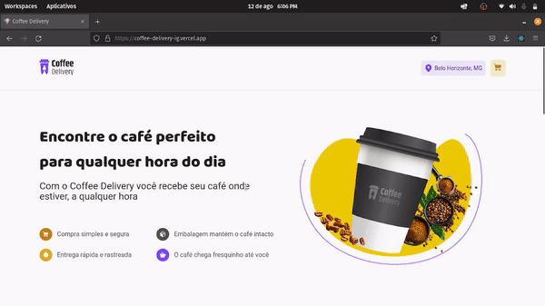

<h1 align="center">
     
</h1>

---

<h1 align="center">
     
</h1>

## 🏷️ Sobre 
**Coffee Delivery**: Desafio proposto no segundo modulo da trilha de React.js do Ignite.
O desafio proposto era:
- [x] Listagem de produtos (cafés) disponíveis para compra
- [x] Adicionar uma quantidade específicas de itens no carrinho
- [x] Aumentar ou remover a quantidade de itens no carrinho
- [x] Formulário para o usuário preencher o seu endereço
- [x] Exibir o total de itens no carrinho no Header 
- [x] Exibir o valor total da soma de itens no carrinho multiplicados pelo valor
## ⚠️OBS
### Adições além do desafio:
- [x] Salvar os dados no localStorage
- [x] Validação de formulário com react-hook-form e zod
- [x] Responsividade
- [x] Estilização para quando o carrinho está vazio
- [x] Modal de loading após finalizar o pedido

---

## 🛠️ Tecnologias e serviços utilizados
Foram utilizadas as seguintes tecnologias para desenvolver a aplicação **Coffee Delivery** :

- [HTML5](https://html.com/)
- [React.js](https://pt-br.reactjs.org/)
- [Typescript](https://www.typescriptlang.org/)
- [styled-components](https://styled-components.com/)

---

## 🗂️ Como baixar e iniciar o projeto 

```bash

    #clonar o projeto
    $ git clone https://github.com/ElisioWander/coffee-delivery.git

    #entrar no diretório
    $ cd coffee-delivery

    #instalar as dependências
    $ npm install

    #iniciar a aplicação
    $ npm run dev
```
### Servidor local
localhost:3000

---

## Autor
### 👤 Elisio Wander

- Linkedin: [@elisioWander](https://www.linkedin.com/in/elisio-wander-b88b69136/)
- Github: [@elisioWander](https://github.com/ElisioWander)
- Site: [elisiowander.vercel.app](https://elisiowander.vercel.app)
- Deploy: [Coffee Delivery](https://coffee-delivery-ig.vercel.app/)

---
## 📝 Licença
Copyright © 2020 [@ElisioWander](https://github.com/ElisioWander/coffee-delivery/blob/main/LICENSE)

Este projeto está sobe a [LICENÇA MIT](https://opensource.org/licenses/MIT)

---

### Desenvolvido 💜 by Elisio Wander
